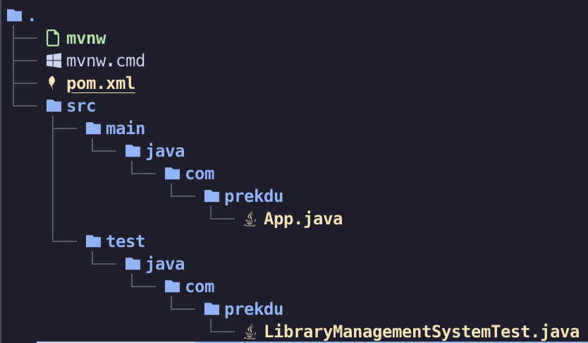

# Linters for Java

After you run the init script, your repo has been initialised with Linters and Static checkers for all your assignments.

Know more about what linters are [here](https://www.sonarsource.com/learn/linter/#:~:text=A%20linter%20works%20through%20the,the%20user%20about%20the%20issue.)

For Java Assignments there are primarily 2 tools involved -

- [PMD](https://pmd.github.io/)
- [Checkstyle](https://checkstyle.sourceforge.io/)

These will enforce certain basic coding conventions for you guys to be aware of before you step into KDU.

:::info
The Java Assignments use Maven for Project Management. You can explore more about Maven [here](https://www.baeldung.com/maven)

A typical Java Project in Maven looks like this -

:::

:::tip
While these linters would be run before each commit, you can manually run them for Java projects and avoid the committing loop by executing `./mvnw clean verify`. Make sure you are inside the project folder before running these commands.

If you want a detailed report of where your code is going wrong and debug it, run `./mvnw clean site`.
This would output something like this - `Checkstyle and PMD Report generated at /Users/asishmahapatra/Desktop/Developer/Company/assignments/java/target/site/project-reports.html` which you can copy paste and open in your browser
:::
